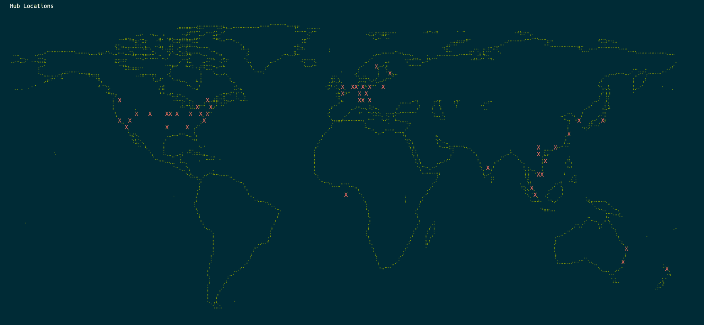

# hubble-world-ts
- Map Hubble nodes part of [Farcaster Hub Protocol](https://docs.farcaster.xyz/hubble/hubble)
- Point to a Hub's log file and it will parse it and display the nodes on a map

## Requirements
- Node.js v21.5.0+
- bun v1.0.21+
- [Optional] [ip2location](https://www.ip2location.io/) API key (see below)
> Note: This project uses [ip2location](https://www.ip2location.io/) for mapping IP addresses to latitude and longitude.

## Usage
- Sample [geoip.json](./data/geoip.json) file is provided in the data folder, see [here](#without-api-key) for usage

### Dependencies
To install dependencies:

```bash
bun install
```

### Run
#### With IP to location mapping API
```bash
GEOIP_API_KEY=<ip2location-api-key> bun run src/index.ts --api --hub-log-file <path-to-hub-log-file> 
```
#### With log watch
```bash
GEOIP_API_KEY=<ip2location-api-key> bun run src/index.ts --api --hub-log-file <path-to-hub-log-file> --watch
```
#### Without API key
```bash
bun run src/index.ts --no-api --geoip-data-file <path-to-geoip-data-file> 
```
Example:
```bash
bun run src/index.ts --no-api --geoip-data-file ./data/geoip.json
```
